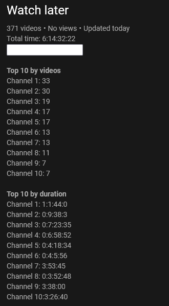
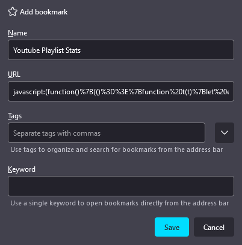

## Youtube Playlist Stats
Little script you can save as a bookmarklet to view some Youtube's playlist stats:
- Total time
- Top 10 channels by duration
- Top 10 channels by number of videos
- Filtering by channel or title

The script works locally and doesn't call any APIs

## Usage
Add the bookmarklet [(How to)](#adding-the-bookmarklet) then go to a playlist on youtube and finally click on the bookmarklet to load the stats.

The script will only work on the videos loaded in the page. If the playlist has more than 100 videos, you will have to scroll down until all of them are loaded in the page to be taken in account. You can run again the bookmarklet, which will update the results.

The input field serves as a search bar to filter the videos, through channel name and video title.

Clicking on a channel name in the `Top 10` sections will show videos of that channel only.

## Dev
After modifying `/src/index.js` you can run `npm run build` to generate a new `/dist/bookmarklet.js`

## Adding the bookmarklet
To add this script as a bookmarklet to your browser's bookrmark toolbar, create a new bookmark, title it whatever you want then copy the whole code inside `/dist/bookmarklet.js` and paste it in the URL field.

